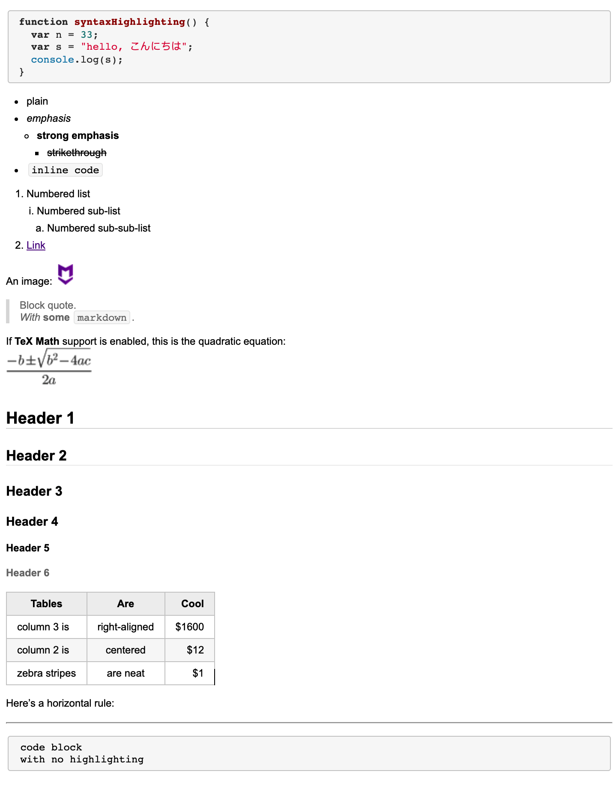
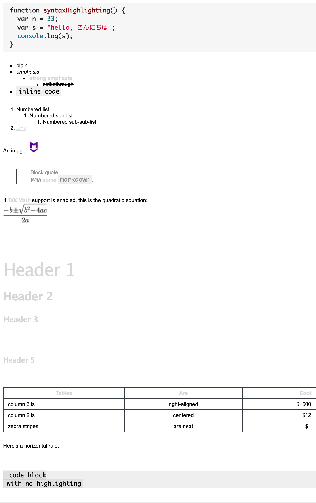
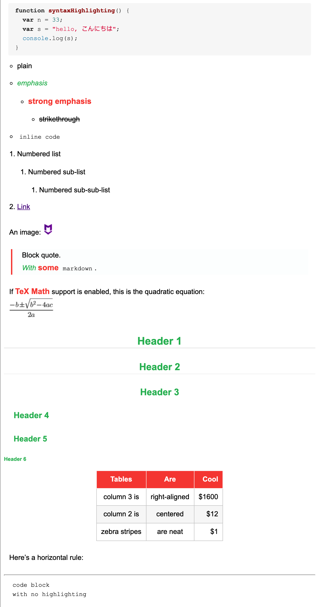
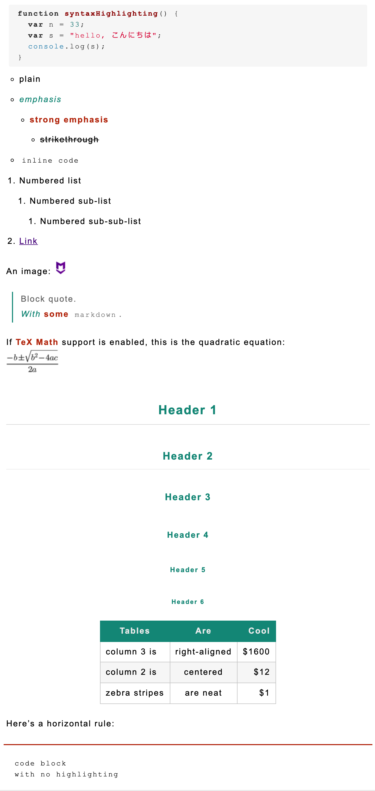

# Markdown-Here-CSS
Organize markdown here CSS.

# [myself](myself/myself.css)

# [style01](style01/default.css)

# [style02](style02/style02.css)

# [style03](style03/style03.css)

# [style04](style04/style04.css)

# [style05](style05/style05.css)

# [style06](style06/style06.css)

# [style07](style07/style07.css)

# [style08](style08/style08.css)

# [style09](style09/style09.css)

# [style10](style10/style10.css)

# [style11](style11/style11.css)

# [style12](style12/style12.css)

# [style13](style13/style13.css)

# [style14](style14/style14.css)

# [style15](style15/style15.css)

# [style16](style16/style16.css)

# [style17](style17/style17.css)

# [style18](style18/style18.css)

# [style19](style19/style19.css)

# [style20](style20/style20.css)

# [style21](style21/style21.css)

# [style22](style22/style22.css)

# [style23](style23/style23.css)

