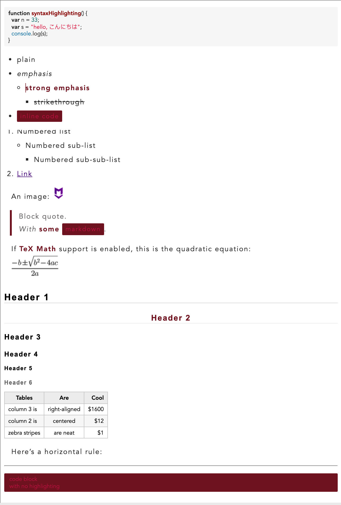

# From

[https://github.com/huanxi007/markdown-here-css/blob/master/%E4%B8%80%E5%9D%97%E8%BE%93%E5%87%BA%E6%B7%B1%E7%BA%A2%E8%89%B2.css](https://github.com/huanxi007/markdown-here-css/blob/master/%E4%B8%80%E5%9D%97%E8%BE%93%E5%87%BA%E6%B7%B1%E7%BA%A2%E8%89%B2.css)

# To

`Basic Render CSS`：基本渲染 CSS

use https://editor.mdnice.com/ markdown content

# Style

