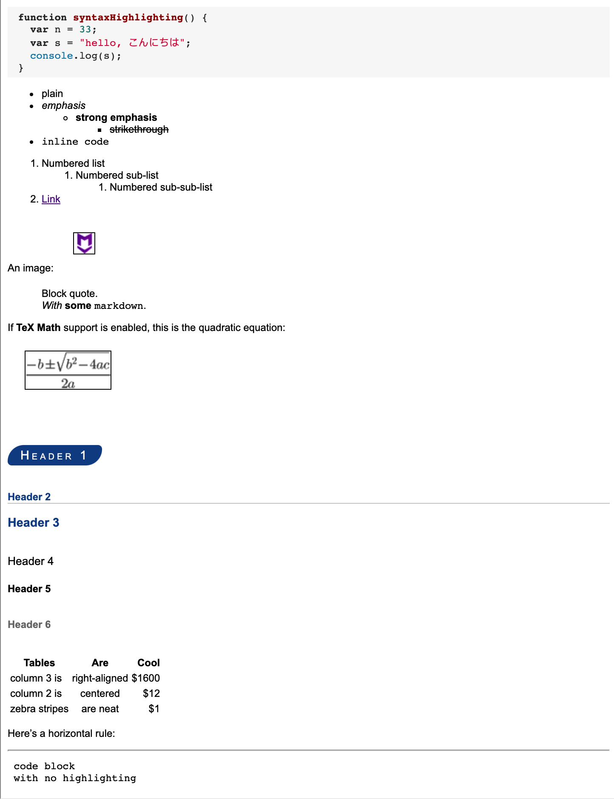

# From

[https://github.com/caseywatts/markdown-here-css/blob/master/default.css](https://github.com/caseywatts/markdown-here-css/blob/master/default.css)

# To

`Basic Render CSS`：基本渲染 CSS

# Style

