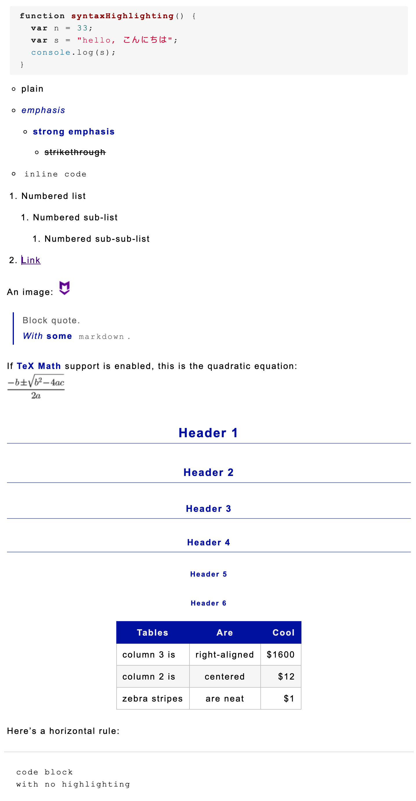

# From

[https://github.com/windy/my_markdown_here_css/blob/master/markdown_here.css](https://github.com/windy/my_markdown_here_css/blob/master/markdown_here.css)

# To

`Basic Render CSS`：基本渲染 CSS

# Style

