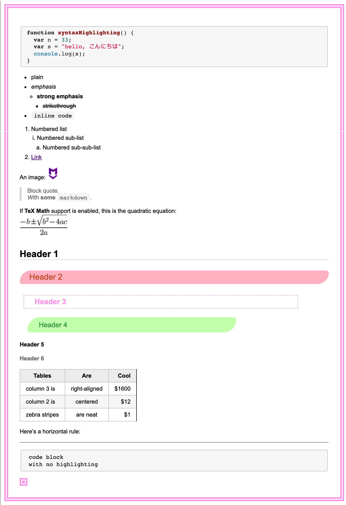

# From

[https://github.com/ykamenashi/my-css-memo/blob/master/markdown-here-nippo.css](https://github.com/ykamenashi/my-css-memo/blob/master/markdown-here-nippo.css)

# To

`Basic Render CSS`：基本渲染 CSS

# Style

